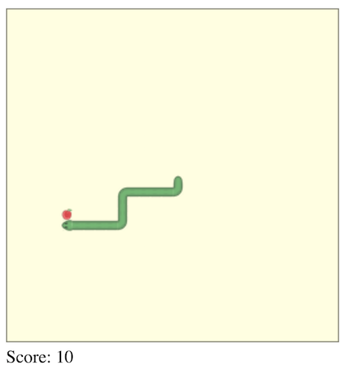

# Snake in JavaScript

Run `index.html` and path into browser to run or use something like `http-server` in game directory.

Arrow keys to control, don't hit the wall or yourself! One point for every food dot eaten. The game speeds up for every food dot eaten.

##### Player Stories

```
As a player of Snake,
So I can play,
I want to the click start to begin the game

As a player of Snake,
So my snake looks like a snake,
I want to the snake to have more than one segment to its body to begin with

As a player of Snake,
So I can have control,
I want to be able to move the snake around with directional keys

As a player of Snake,
So my snake does not disappear,
I want to be the game to be confined in a set area with a border

As a player of Snake,
So there is an end game,
I want the game to end if the snake runs into itself or a wall

As a player of Snake,
So there is something to aim for,
I want a 'food' dot for the snake to eat to appear

As a player of Snake,
So that it becomes more challenging,
I want the snake’s body to grow longer every time it eats a dot

As a player of Snake,
So that it becomes even more challenging,
I want the snake’s speed to increase over time
```


